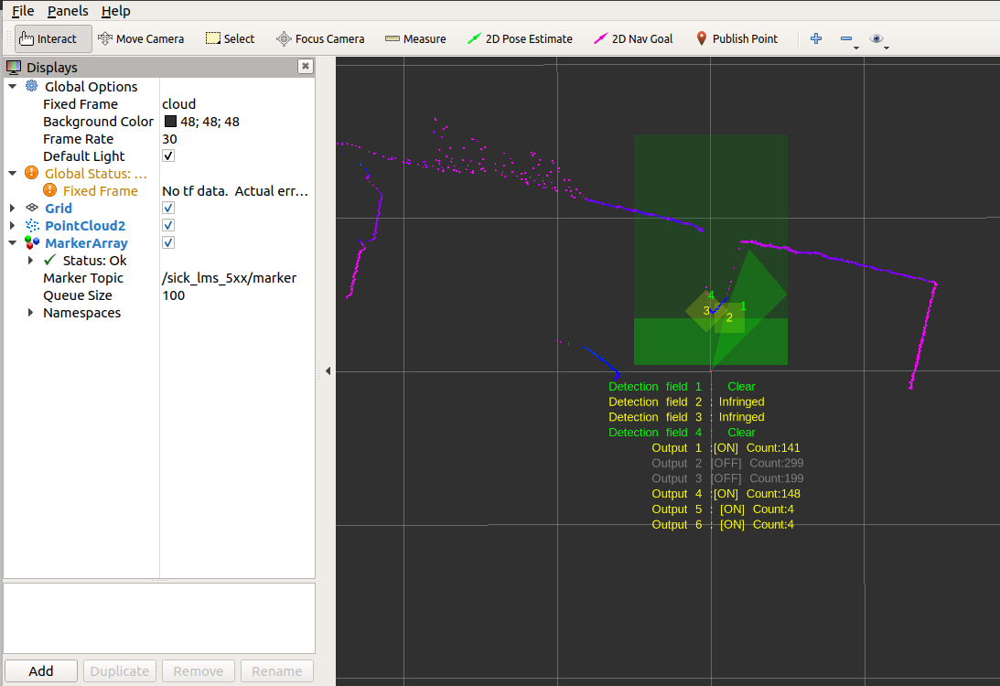
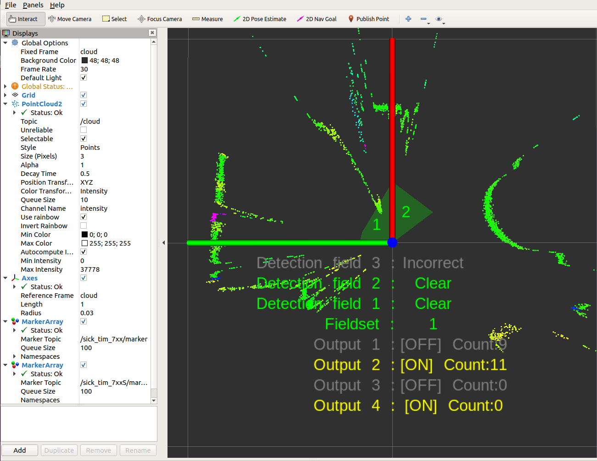

# Unit tests

For a quick unit test after installation without the sensor hardware, a test server is provided to simulate a scanner. It implements a simple tcp server, which responds to binary cola messages and sends predefined LMDscandata to a tcp-client. The sick_scan driver can connect to the local test server instead of the lidar device for offline-tests. Please note, that this test server does not emulate a Lidar sensor. It just sends some simple scan data and response messages to a tcp client. It can be used for a quick unit test after build and install.

## Build

To build the test server, activate cmake option `ENABLE_EMULATOR` in CMakeLists.txt and rebuild sick_scan. By default, option `ENABLE_EMULATOR` is switched off.

## Run

For a unit test of LMS1xx, run the following commands in different terminals:

```
cd sick_scan
source ./install/setup.bash

# Start sick_scan emulator
roslaunch sick_scan emulator_lms1xx.launch &
sleep 1

# Start rviz
rosrun rviz rviz -d ./src/sick_scan/test/emulator/config/rviz_lms1xx.rviz &
sleep 1

# Start sick_scan driver
roslaunch sick_scan sick_lms_1xx.launch hostname:=127.0.0.1
```

For a unit test of LMS5xx, run the following commands in different terminals:

```
cd sick_scan
source ./install/setup.bash

# Start sick_scan emulator
roslaunch sick_scan emulator_lms5xx.launch &
sleep 1

# Start rviz
rosrun rviz rviz -d ./src/sick_scan/test/emulator/config/rviz_lms5xx.rviz &
sleep 1

# Start sick_scan driver
roslaunch sick_scan sick_lms_5xx.launch hostname:=127.0.0.1
```

For a unit test of LMS7xx, run the following commands in different terminals:

```
cd sick_scan
source ./install/setup.bash

# Start sick_scan emulator
roslaunch sick_scan emulator_01_default.launch &
sleep 1

# Start rviz
rosrun rviz rviz -d ./src/sick_scan/test/emulator/config/rviz_emulator_cfg.rviz &
sleep 1

# Start sick_scan driver
roslaunch sick_scan sick_tim_7xx.launch hostname:=127.0.0.1
```

For a unit test of LMS7xxS, run the following commands in different terminals:

```
cd sick_scan
source ./install/setup.bash

# Start sick_scan emulator
roslaunch sick_scan emulator_01_default.launch &
sleep 1

# Start rviz
rosrun rviz rviz -d ./src/sick_scan/test/emulator/config/rviz_emulator_cfg.rviz &
sleep 1

# Start sick_scan driver
roslaunch sick_scan sick_tim_7xxS.launch hostname:=127.0.0.1
```

Alternatively, you can just run the test scripts provided in folder `sick_scan/test/scripts`:

```
cd sick_scan/test/scripts
./makeall.bash
./run_simu_lms1xx.bash
./run_simu_lms5xx.bash
./run_simu_tim7xx_tim7xxS.bash 
```

Make sure to finish all sick_scan nodes after a test. All nodes can be killed by
```
rosnode kill -a ; sleep 1
killall sick_generic_caller ; sleep 1
killall sick_scan_emulator ; sleep 1
```

## Examples

rviz example screenshots using sick_scan with LMS1xx and LMS5xx test server:



rviz example screenshots using sick_scan with LMS7xx and LMS7xxS test server:



Further examples are provided in folder `test/scripts`.
