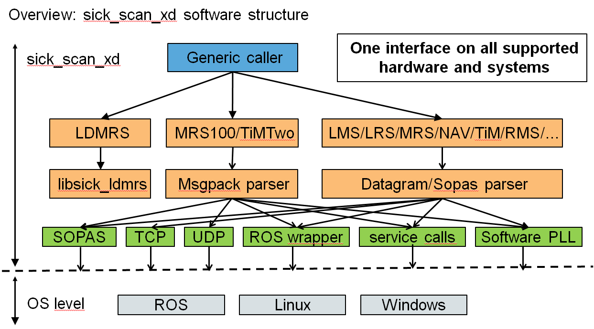
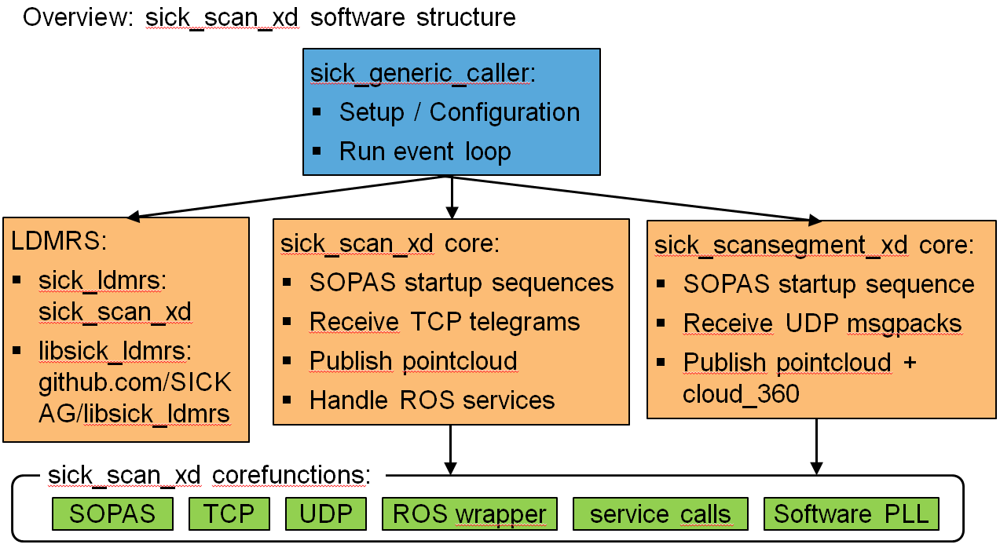
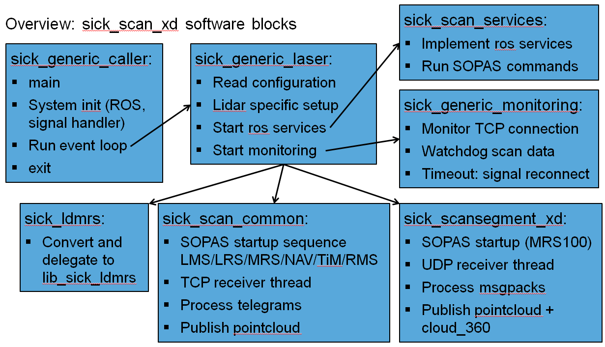
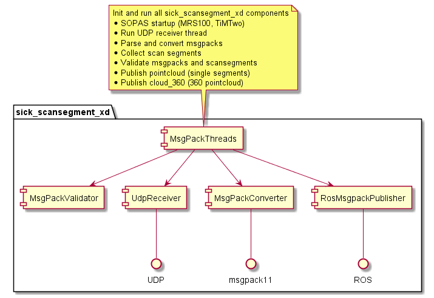
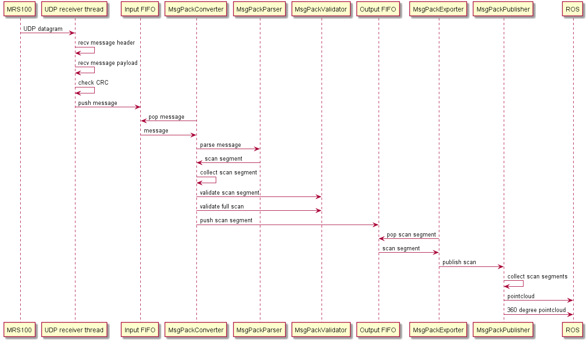

# Software Overview

The sick_scan_xd software is essentially affected by its use cases:

* Implement the common tasks for different lidars:
    * Provide driver software on Linux and Windows, generic, ROS-1 and ROS-2
    * Receive and convert scan data, publish pointcloud
    * Run startup, configuration and setup

* Use cases: 
    * Provide a pointcloud to the customer/application
    * Provide a common highlevel interface for all supported lidars
    * Hide datagram details, encodings and parsing knowhow
    * The most common use case is to run lidar + sick_scan_xd to get a pointcloud.

* Software requirements:
    * Support different lidars (LMS, LRS, LDMRS, MRS, NAV, TiM, RMS, multiScan, etc.) 
    * Support different OS (Linux, Windows)
    * Support different targets (ROS-1, ROS-2, generic)
    * Support different protocols (Cola-A, Cola-B, TCP, UDP, msgpack)
    * Implement parser for different telegrams (scandata, scancfg, fields, etc.)

This overview describes the most important modules and their relationship.

## Software structure

The following figures show the most important software blocks:

sick_scan_xd contains 6 main functional blocks:

* sick_generic_caller and sick_generic_laser for initialization and setup:
    * Read configuration from launchfile:
        * ROS1: `ros::NodeHandle::getParam`
        * ROS2 and generic: `LaunchParser` (ros-wrapper)
    * Lidar specific setup:
        * class `sick_scan::SickGenericParser`: lidar specific properties and messages parsing
        * Set and get lidar specific properties: number of layers, angular resolution, etc.
        * Parse and convert scan data, input: scan data (ascii or binary datagram), output: `ros::sensor_msgs::LaserScan`
        * class `sick_scan::SickScanCommonTcp`: receive TCP messages, convert and publish pointcloud
    * Start ros services:
        * class `sick_scan::SickScanServices`: register ros services, convert from/to SOPAS
    * Start monitoring:
        * class `sick_scan::SickScanMonitor`: monitor scan data, reinit on timeout
        * class `sick_scan::PointCloudMonitor`: monitor pointcloud, reinit on timeout
* sick_scan_common for the most common lidar devices (LMS, LRS, MRS, NAV, TiM, RMS, etc.):
    * Implemention by SickScanCommon and SickScanCommonTcp
    * Uses SickGenericParser for lidar specific properties and parsing
    * Runs common tasks for LMS/LRS/MRS/NAV/TiM/RMS:
    * Run SOPAS startup sequence
    * Run TCP receiver thread
    * Process telegrams: parse and convert to pointcloud
    * Publish pointcloud
* sick_ldmrs for LDMRS support using the ldmrs-library from https://github.com/SICKAG/libsick_ldmrs.git
* sick_scansegment_xd for multiScan136 lidars using SOPAS, msgpack and UDP-communication
* sick_scan_services for ros services
* sick_generic_monitoring for monitoring and re-initialization in case of errors (e.g. network errors).

The following figures show these 6 functional blocks:

The function blocks depend on and use the underlying system (ROS, TCP, etc.):

## Message receiving and message handling

Message receiving and message handling are decoupled, i.e. both tasks run in separate thread and exchange messages via a FIFO-buffer. This way, message handling cannot block tcp recv and vice versa. The following figure shows the message handling:

The following figure shows the sequence diagram for a LMDscandata telegram:

Incoming TCP messages and exported pointcloud messages are monitored. sick_scan_xd reinitialises the lidar and the tcp connection in case of timeouts.

## sick_scansegment_xd

sick_scansegment_xd implements support for multiScan136 lidars using SOPAS, msgpack and UDP-communication. It has 5 functional blocks:

* class `sick_scansegment_xd::MsgPackThreads`:
    * Init and run all sick_scansegment_xd components
    * SOPAS startup (multiScan136)
* class `sick_scansegment_xd::UdpReceiver`:
    * Run UDP receiver thread
* class `sick_scansegment_xd::MsgPackConverter`:
    * Parse and convert msgpacks
    * Collect scan segments
* class `sick_scansegment_xd::MsgPackValidator`:
    * Validate msgpacks and scansegments
* class `sick_scansegment_xd::RosMsgpackPublisher`:
    * Publish pointcloud (single segments)
    * Publish cloud_fullframe (fullframe pointcloud, 360 deg for multiScan136)

The following figure shows the compoenent diagram for sick_scansegment_xd:

Message receiving, converting and publishing run in 3 separate threads and exchange their messages via a FIFO-buffer.

The following figure shows the sequence diagram for a multiScan136 msgpacks:

## Files and folders

The source files for the sick_scan_xd core can be found in the following folders:
* driver/src: source files
* include: header files
* launch: configuration
* msg: ros messages definitions
* srv: ros services definitions
* roswrap: ros wrapper (ROS-2 and generic)

These folders are required to build sick_generic_caller.

Besides [README.md](../README.md) and [CHANGELOG.md](../CHANGELOG.md), all documentation can be found in the doc folder. 

Additional folders for sick_scan_xd support, development and test are:
* test: test scripts and emulator
* tools: additional development tools
